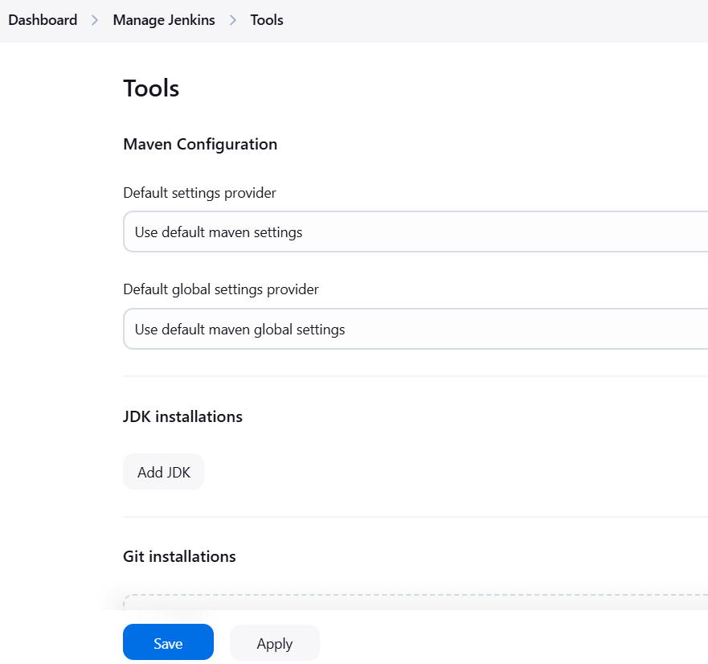
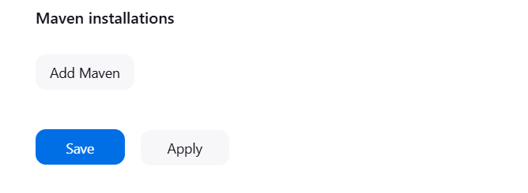
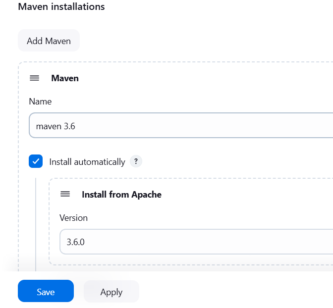

# JENKINS-TERRAFORM
Create an EC2 server on AWS:
intance type is t2.small
create keypair or select existing key
open security group to 8080 [0.0.0.0]
launch instance
SSH into the server
Install Jenkins  $ Java on the server
 #sudo yum update –y
 #sudo wget -O /etc/yum.repos.d/jenkins.repo \
    https://pkg.jenkins.io/redhat-stable/jenkins.repo
 #sudo rpm --import https://pkg.jenkins.io/redhat-stable/jenkins.io-2023.key
                      OR 
use the commands below

 #sudo yum upgrade
 #sudo dnf install java-17-amazon-corretto -y
 #sudo yum install jenkins -y
 #sudo systemctl enable jenkins
 #sudo systemctl start jenkins
 #sudo systemctl status jenkins
# to install maven on jenkins
go to managed jenkins
select tools and you will find Maven configuration
you scroll right down to the bottom you will see maven installation

click on add maven

give a name (maven 3.6)
select the version of your choice(3.6.0)
then click on save
go back to tools and check if the installation was successful.
add it to your jenkinsfile under tools