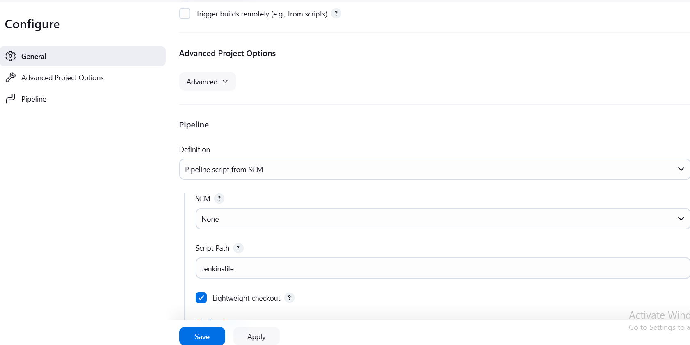
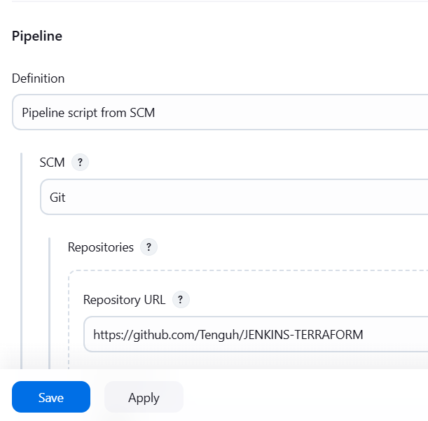
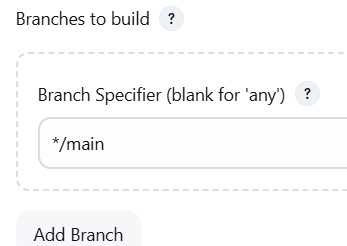

# JENKINS-TERRAFORM
Create an EC2 server on AWS:
intance type is t2.small
create keypair or select existing key
open security group to 8080 [0.0.0.0]
launch instance
SSH into the server
Install Jenkins  $ Java on the server
 #sudo yum update –y
 #sudo wget -O /etc/yum.repos.d/jenkins.repo \
    https://pkg.jenkins.io/redhat-stable/jenkins.repo
 #sudo rpm --import https://pkg.jenkins.io/redhat-stable/jenkins.io-2023.key
                      OR 
use the commands below

 #sudo yum upgrade
 #sudo dnf install java-17-amazon-corretto -y
 #sudo yum install jenkins -y
 #sudo systemctl enable jenkins
 #sudo systemctl start jenkins
 #sudo systemctl status jenkins
#### To install Maven on Jenkins
Go to managed jenkins
Select tools and you will find Maven configuration

you scroll right down to the bottom you will see maven installation!
[alt text](image-1.png)

click on add maven

Give a name (maven 3.6)
Select the version of your choice(3.6.0)
Then click on save.

Go back to tools and check if the installation was successful.
Include it to your jenkinsfile under tools.

#### Install Git on your jenkins sever using the command:
sudo yum install git -y

#### Creating a Job in Jenkins
Go to Jenkins dashboard
Click on New Item!
[alt text](image-3.png)

Give the Item a name
select Pipeline
Click on OK
This takes you to the configure page to configure the pipe
scoll down to Advanced Project Option

select pipeline script from SCM
under SCM click on the drop down arrow and seclect Git
add the URL of your get repository

Under Credentials click on Add and select jenkins.
takes you to a page to add jenkins credentials
Add your github username and password
Add an ID(it could be any name)

Click on Add
Go under credentials
Click on the drop down arrow and select your username
Sroll down to Branch to build
make sure the branch indicated there is same with the one you are using in your gethub

for me i  had to change master to main

Click on Save.
click on build now to see if the first stage of your pipeline is working well

#### Stage 2
Creating the Dockerfile
add a new stage to your Jenkinsfile indicating building the docker image

Go back to managed jenkins
click on credentials
click on add credentials
add your dockerhub username and password
give it an ID
Click on save

#### Installing docker on your server by running the following commands
sudo yum update -y && sudo yum install -y docker
sudo systemctl start docker
sudo usermod -aG docker ec2-user

logout of the server and ssh again
run the command docker ps to see if you can run docker commands without sudo
check if you can run docker commands in jenkins by switching to jenkins using the command
sudo su -s /bin/bash jenkins
run docker ps.
you will have permission denied
if you use sudo docker ps you will be asked to input a password

To avoid these error
get into the sudo file and add jenkins in docker
sudo visudo

